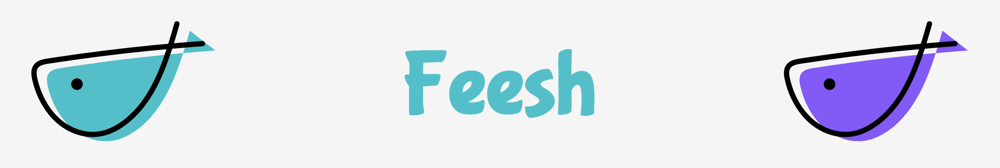
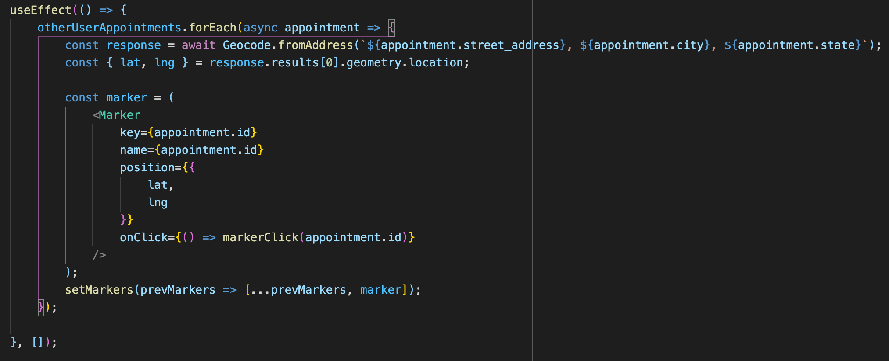
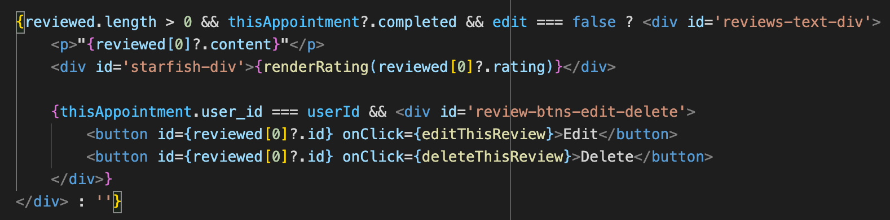
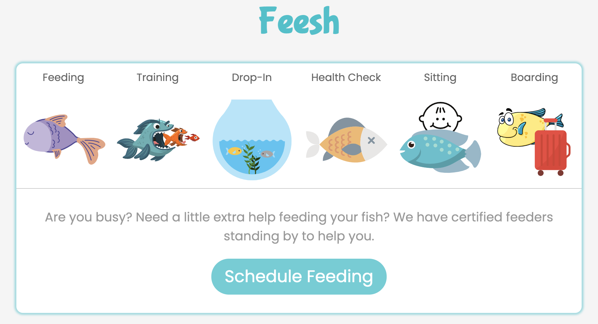

# Welcome to Feesh

### Feesh is a clone of Wag with it's own fish specialization.  It's a platform for busy people with busy lives or someone going on vacation to have a certified "Feesher" come and take care of their fish.  Users can create appointments and "Feeshers" can respond to these appointments. Services offered include fish feeding, training, drop-ins, health checks, fish sitting, and extended boarding of fish.  Feesh allows people to know their fish are receiving the love and care they need to live happy lives.

---
### Index

[Technologies](#Technologies)

[Key Features](#Key-Features)

[Visit Feesh](https://hobbetsy.herokuapp.com/)

[Database Schema & Backend Routes](https://github.com/bilbopicard/feesh/wiki/Database-Schema-&-Backend-Routes)

[Wireframes & Frontend Routes](https://github.com/bilbopicard/feesh/wiki/Wireframes-and-Frontend-Routes)

[Details](#Details)

[Feature Spotlight](#Feature-Spotlight)

[Code Snippets](#Code-Snippets)

[Feesh Future Roadmap](#Hobbetsy-Future-Roadmap)

[Technical Instructions for Project](#Technical-Instructions-for-Project)

[Pre-Project Planning](#Pre-Project-Planning)

[Developer](#Developer)

[Special Thanks](#Special-Thanks)

---
### Technologies

* Python
* Flask
* JavaScript
* React-Redux
* JSX
* CSS
* SQLAlchemy
* PostgreSQL
* Heroku
* VSCode
* Docker
* npm
* Figma
* Adobe Photoshop
* Adobe XD
* DrawSql

### Key Features
* Appointments
    - A user can create an appointment for somebody to come and feed their fish
    - A user that is a certified "Feesher" can view the appointments made by other users

* Reviews/Ratings
    - A user can leave a review and rating for the "Feesher" that took care of their fish

### Details

>“A fish will never realize its potential until you throw it in water.”
    ― Matshona Dhliwayo

Feesh is a full-stack application that gives busy people more flexibility in their lives without overly worrying about how their fish are faring while they are away.  Although not fluffy and cuddly, even fish need some love and attention and it's nice to know yours are being visited by someone certified to take care of them.

### Visit Feesh
https://feesh-app.herokuapp.com/

### Feature Spotlight
* Google Maps
    - A user can check google maps for locations of appointments near them based on a pin on the map

* Calendar
    - Users can go to their calendar and view pages of upcoming and completed appointments they have scheduled or responded to as a "Feesher"

### Code Snippets
* Convert address to latitude and longitude for map markers

* Conditionals to display different things based on user properties of the logged in user

### Feesh Future Roadmap
- Payment method
- Video chat to screen potential "Feeshers"
- Filtering of appointments when searching for a "Feeshing Trip"

### Technical Instructions for Project
* Git Clone
* On local machine, run 'pipenv install' to install required dependencies.
* Create initial database user and database as stated in .env.example file.
* Enter your pip environment.
* In terminal flask run to start backend.
* In a separate terminal cd into the react app file. 
* Run npm start to start the front end server. 
* This should start new page in your browser. localhost:port in browser.

### Pre-Project Planning
* Picked and researched a clone (Wag), then decided on a different theme
* Created table schema for database relations with DrawSQL
* Created a basic wire-frame using Figma.
* Decided on realistic features that I would create a nice user experience

### Developer
* Jamie Sullivan [Github](https://github.com/bilbopicard) [Linkedin](https://www.linkedin.com/in/sullivan-jamie/)  

### Special Thanks
* Wag - For inspiring a fun project idea that was enjoyable to do.
* Canva - For providing cute images for me to use because I am a terrible artist. 
* Chris Oney - For helping me get through and learn from the copious amount of bugs I encountered
* Patrick Nusbaum - For sitting in a zoom room with me for over a week

